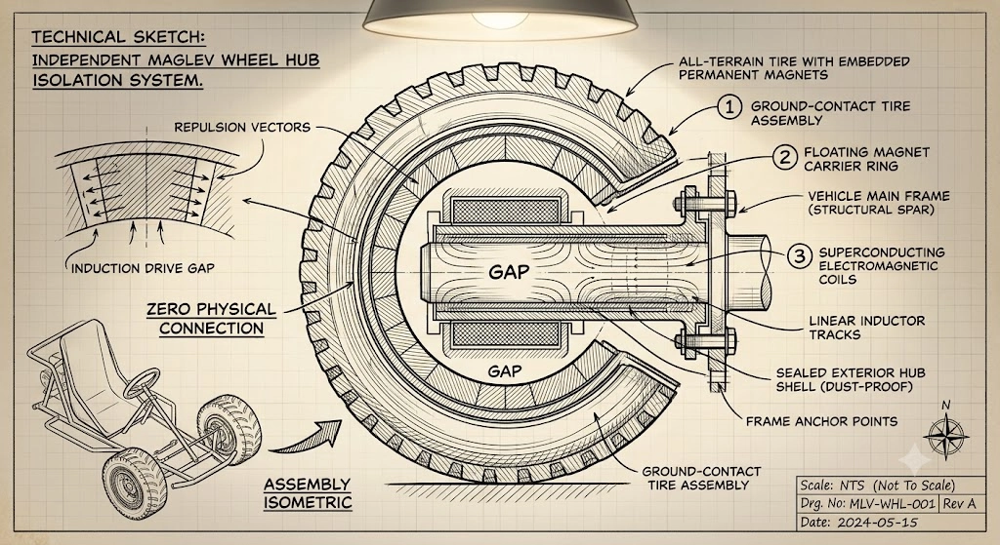

  <table>
    <tr>
      <td colspan="2" class="text-center pb-2">
        
        
MLV-01 Strider

      </td>
    </tr>
    <tr><th colspan="2">MLV-01 "Strider" Maglev Buggy</th></tr>
    <tr><th>Classification</th><td>Recreational All-Terrain Vehicle</td></tr>
    <tr><th>Common Names</th><td>Strider, Dust-Skimmer, Glider-Kart</td></tr>
    <tr><th>Manufacturer</th><td>Fabrication Annex 1</td></tr>
    <tr><th>Development</th><td>Science and Technology Center</td></tr>
    <tr><th>Technology</th><td>Hubless Maglev Drive, Kinetic Harvesting</td></tr>
    <tr><th>Capacity</th><td>1-2 passengers (twin recumbent)</td></tr>
    <tr><th>Dimensions</th><td>2.5m L × 1.2m W × 0.8m H</td></tr>
    <tr><th>Wheel Diameter</th><td>45cm (hubless maglev)</td></tr>
    <tr><th>Power Source</th><td>Solid-state battery + regenerative suspension</td></tr>
    <tr><th>Top Speed</th><td>85 km/h</td></tr>
    <tr><th>Control System</th><td>AI-assisted armrest controls</td></tr>
    <tr><th>Safety Features</th><td>AI governor, terrain scanning, geo-fencing</td></tr>
    <tr><th>Primary Use</th><td>Recreation, light utility, desert exploration</td></tr>
    <tr><th>Operator</th><td>New Eden Colony</td></tr>
    <tr><th>Status</th><td>Active service</td></tr>
  </table>

# MLV-01 "Strider" Maglev Buggy

**Class:** Recreational All-Terrain Vehicle
**Manufacturer:** Fabrication Annex 1
**Development:** Science and Technology Center (Prototype Workshops)
**Production Era:** 2200s - Present

## Overview
The MLV-01 is a high-mobility recreational vehicle designed for low-gravity and rough-terrain environments (specifically lunar and Martian regolith). It bridges the gap between a high-speed go-kart and a rugged dune buggy, utilizing advanced magnetic levitation to provide a "zero-friction" ride experience.

## Technical Specifications
*   **Capacity:** 2 Passengers (Twin Recumbent)
*   **Driver Fit:** Adjustable rail system (Fits US Size 7+)
*   **Top Speed:** 85 km/h
*   **Drive Type:** 4-Wheel Independent Hubless Maglev
*   **Power Source:** Solid-State Battery + Kinetic Regenerative Suspension

## Propulsion: The Independent Maglev Wheel
{: width="50%" }
The vehicle utilizes a revolutionary **Hubless Induction Drive**.
*   **Zero Physical Connection:** There is no axle. The tire assembly floats around the central structural spar via a magnetic gap.
*   **Ground-Contact Tire:** The tire contains embedded permanent magnets.
*   **Induction Drive:** Superconducting coils in the hub create a rotating magnetic field that drives the tire.
*   **Sealed Hub:** The central hub is hermetically sealed to protect superconducting components from abrasive regolith dust.

## Suspension & Ride Quality
The MLV-01 features a **Dual-Stage Magnetic Isolation System**:
1.  **Wheel Isolation:** The tires float on "Repulsion Vectors," allowing them to absorb large impacts from rocks and craters without transferring shock to the chassis.
2.  **Cockpit Isolation:** The twin recumbent seats ride on a secondary maglev rail. Active sensors adjust the magnetic field in real-time to cancel out G-forces.
    *   *Result:* While the wheels violently bounce over rough terrain, the occupants experience a smooth, gliding sensation, often described as "flying through space."

## Power Generation: Kinetic Harvesting
The vehicle employs **Electrodynamic Suspension (EDS)**. As the wheels bounce over uneven terrain, the fluctuating magnetic gap between the tire and the hub induces an electrical current (Faraday's Law of Induction).
*   **Rough Terrain Bonus:** The bumpier the road, the more efficiently the vehicle recharges its batteries.
*   **Smooth Terrain Mode:** On flat surfaces, the vehicle runs on stored battery power.

## Controls
*   **Seating:** Twin recumbent seats with telescoping magnetic rails to accommodate drivers from age 7+ to adult.
*   **Interface:** Controls are mounted on the armrests to maintain stability during high-G maneuvers.
    *   **Right Arm:** Throttle and Steering (Torque Vectoring).
    *   **Left Arm:** Braking (Regenerative) and Suspension Height adjustment.

